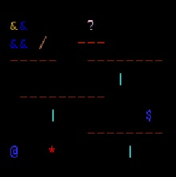
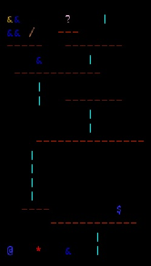

# LDTS_T08_G0800 - DONKEY KONG

## Game Description
DONKEY KONG is played as Mario (the jumping man) and the goal is to defeat Donkey Kong (the big monkey) by climbing up the existing ladders and structures (the set of platforms), avoid the moving barrels and fire creatures. The player (Mario) is controlled with the Keyboard Arrows.

This project was developed by *Gabriel Machado Jr.* (up2020060@edu.fe.up.pt), *Milena Gouveia* (up202008862@edu.fe.up.pt) and *Sofia Moura* (up201907201@edu.fe.up.pt) for LDTS 2021⁄22.

## Screenshots
### Levels
(the levels are loaded from files)

  

  <b><i>Level 1 </i></b>

 
 

  

  <b><i>Level 2 </i></b>

