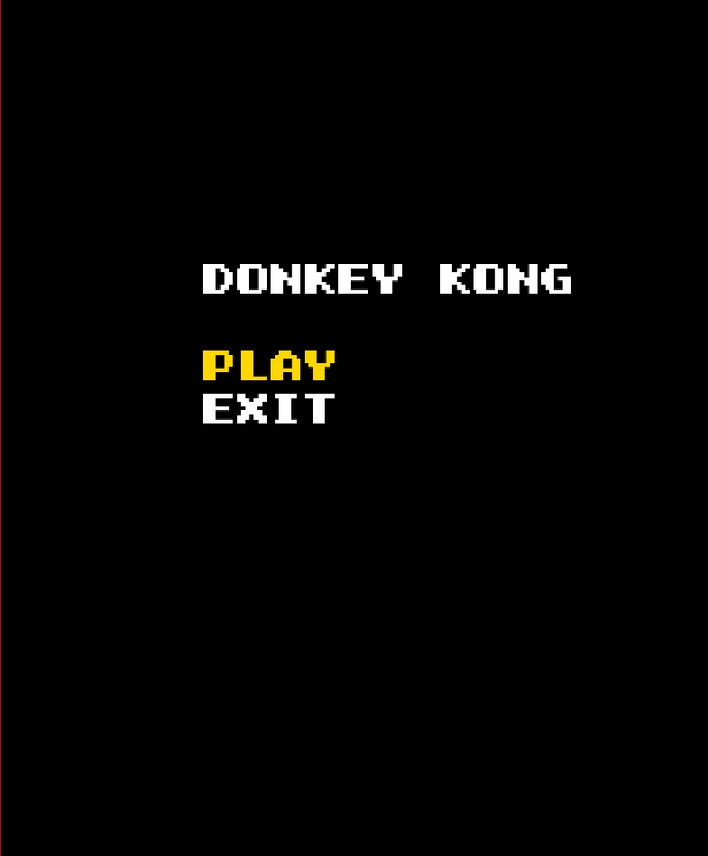
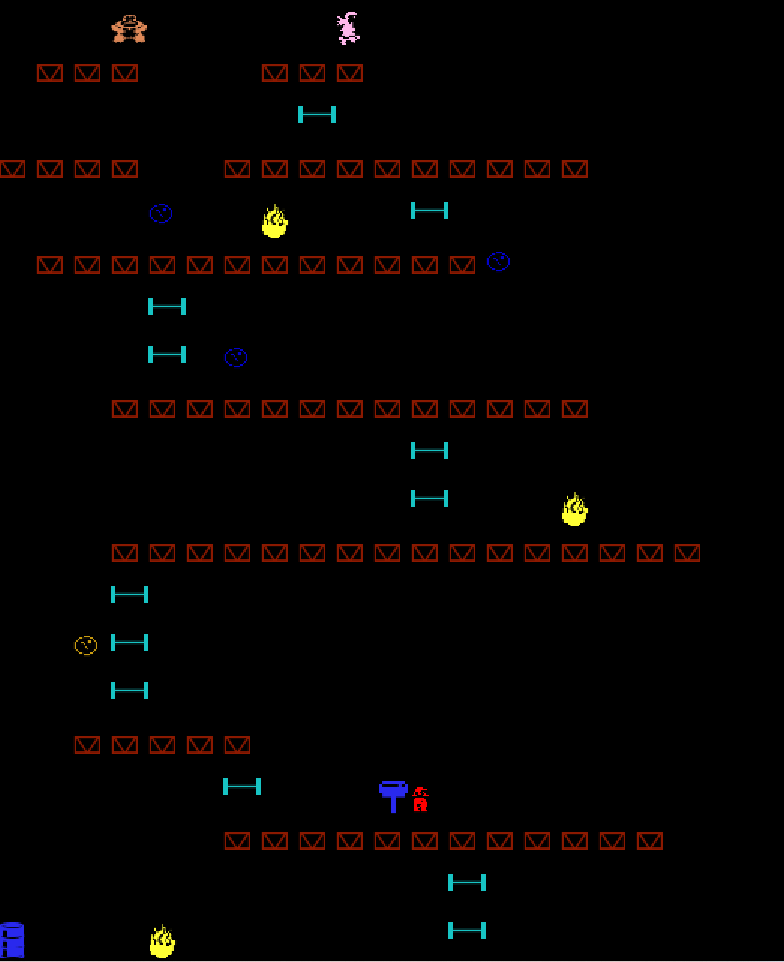

# LDTS_T08_G0800 - DONKEY KONG

## Game Description
DONKEY KONG is played as Mario (the jumping man) and the goal is to defeat Donkey Kong (the big monkey) by climbing up the existing ladders and structures (the set of platforms), avoid the moving barrels and fire creatures. The player (Mario) is controlled with the Keyboard Arrows.

This project was developed by *Gabriel Machado Jr.* (up202008860@edu.fe.up.pt), *Milena Gouveia* (up202008862@edu.fe.up.pt) and *Sofia Moura* (up201907201@edu.fe.up.pt) for LDTS 2021⁄22.

##How to play

You can move the character using
- `Left arrow` to move left
- `Right arrow` to move right
- `Up arrow` to climb ladders
- `Tab` to jump fire enemies

- Mario can only walk on top of the structures
- Mario has a score that increases every time he jumps over a barrel or gets a hammer
- Mario can hit barrels or fire enemies every time he grabs the hammer, in a total of 5 hits

## Screenshots
##Menu

  

 
 

##Game
(the level is loaded from file)

  

 
 