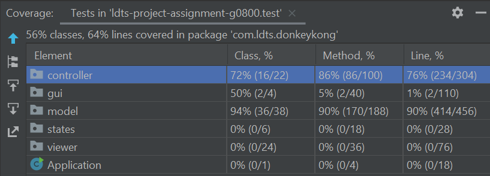
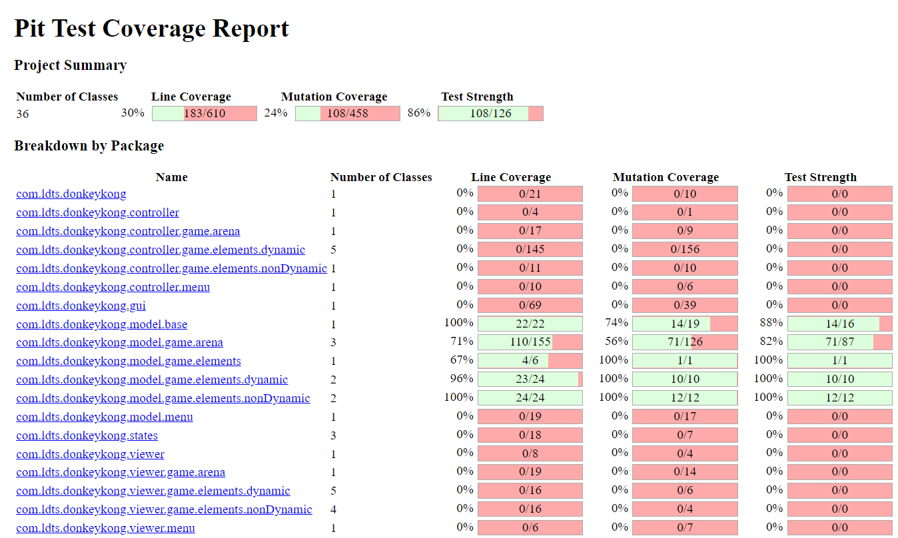

# LDTS_T08_G0800 - DONKEY KONG

## Game Description
DONKEY KONG is played as Mario (the jumping man) and the goal is to rescue the Princess from Donkey Kong (the big monkey) by climbing up the existing ladders and structures (the set of platforms), avoid the moving barrels and fire creatures. The player (Mario) is controlled with the Keyboard Arrows.

**How to play**

You can move the character using
- `Left arrow` to move left
- `Right arrow` to move right
- `Up arrow` to climb ladders
- `Tab` to jump fire enemies

- Mario can only walk on top of the structures
- Mario has a score that increases every time he jumps over a barrel or gets a hammer
- Mario can hit barrels or fire enemies every time he grabs the hammer, in a total of 5 hits

This project was developed by Gabriel Machado Jr. (up202008860@edu.fe.up.pt), Milena Gouveia (up202008862@edu.fe.up.pt) and Sofia Moura (up201907201@edu.fe.up.pt) for LDTS 2021⁄22.

## Design Patterns
**Architectural Pattern**

To approach the way the game is built, we decided to implement the MVC (Model-Viewer-Controller) design pattern:

- Model: stores and represents all the structures of the game and does nothing else. It doesn't depend on the controller or the viewer
- Controller: connects the model and the user interaction by commanding all the changes that occur.
- Viewer (gui): outputs the representation of the model's data and handles the interaction with the user (by pressing the keyboard's keys)

Why we decided to use it:
- easier for simultaneous development
- better testability because supports TDD
- easily modifiable
- easy planning and maintenance

**Abstract Factory Pattern**

  

  <b><i>Abstract Factory Pattern </i></b>

 
 

Participating classes: AbstractFactory - GameElement
                       Concrete factory - StaticElement (concrete products - Princess, Structure, Stair, Ladder, OilBarrel), DynamicElement (concrete products - FireEnemy, Hammer, Mario, Barrel, Donkey)
                       Client - Arena
                        

Why we decided to use it:
- it isolates clients from implementation classes (defining the game element as an abstract superclass for all game elements, and separating the elements by dynamic ones and static ones, letting these subclasses be responsible to create the instance of the class)

**State Pattern**

  

  <b><i>State Pattern </i></b>

 
 

Participating classes: Context - Application
                       State - State
                       Concrete states - MenuState, GameState, InstructionState

Why we decided to use it:
- minimizes conditional complexity, eliminating the need for if and switch statements in objects that have different behavior requirements unique to different state transitions

## Implemented Features
- Starting menu
- Super Mario Movement
- Ladders and Structures
- Hammer
- Moving enemies with different movements (barrels and fire enemies)

## Code Smells and Refactorings
##Extracting method
We verified that the method jump() in MarioController class is a long method and what it does is check if Mario is not trying to jump in a place where there's a ladder and if not:
- checks if there's a fire enemy on one of Mario's sides
- checks if there's a hammer right above Mario's current position
If one of these two conditions is verified Mario jumps

To remove this smell we could split the method into two function calls, using the Extracting method refactoring: one that would make Mario jump over a fire enemy and another one to make him catch the hammer.

##Dead code
Later in the project, we realized we had an unneeded method in the Arena class, isOilBarrel(), which we could solve by simply deleting it.

##Large class
We also detected that ArenaBuilderLoader is a large class, because we have methods that read the same file multiple times to create each elements of the game and we could simplify it by having a method to read simple elements (Donkey, Mario, Princess, etc.) and two methods to load the more complex ones (Structures and Ladders).
This could be solved with the Extract Method refactoring and this way there would be only 3 loops repeated

##Extracting variable
The FireEnemyController and BarrelController classes have statements with **complicated expressions** (eg: some return values and if statements) that are complicated to interpretate, which could be solved by storing the values in variables and using those to simplify the statements, using the **Extract Variable refactoring**.

##Some refactorings that were done
- In some controllers we had **duplicate code** in the move method, to check if the elements were moving above the structures. We ended up refactoring those move methods by creating a new one called hasStructureBelow in the Arena class.

- We verified that we had a data class (Score class), which only had getters and setters and could be used as a field in Mario class. We solved that by using the **move methods refactoring**.

- In Arena class, there are a few boolean methods that had the code smell **Inline Method** and we used the **Speculative Generality refactoring** to solve it.

##Tests

